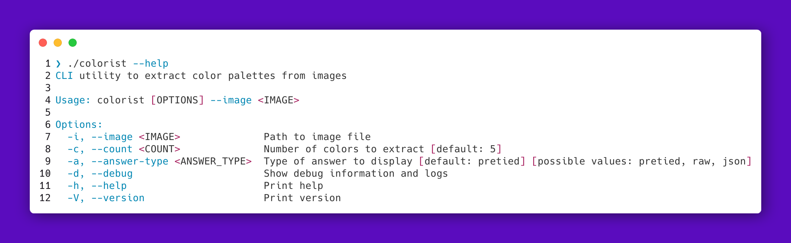

# Colorist CLI

A minimalist, high-performance command-line tool written in Rust to extract dominant color palettes from images using the K-Means clustering algorithm. It can output results in a beautiful TrueColor terminal format, raw RGB values, or valid JSON for easy integration with your custom window manager themes (Hyprland, Niri, i3), polybars, or terminal setups.

---



---

## Features

* **Fast Clustering**: Uses optimized K-Means algorithm to find real dominant colors instead of random pixel sampling.
* **Smart Performance**: Downscales massive high-resolution images in memory before processing, reducing calculations by thousands of times without affecting palette accuracy.
* **Luminance Sorting**: Automatically sorts extracted colors from darkest to lightest based on relative human-eye perception formulas.
* **Flexible Outputs**: Supports rich terminal output with true-color circles, plain text, or structured JSON.
* **Debug Mode**: A granular `--debug` flag to see exactly what is happening under the hood (image loading, scaling metrics, and pixel processing times).

---

## Installation

### Prerequisites

Make sure you have the Rust toolchain installed (cargo, rustc). If not, get it from https://rustup.rs/.

### Build from Source

Clone the repository and compile the release version:

```bash
git clone https://github.com/ilushacode/colorist.git
cd colorist
cargo build --release
```

The compiled binary will be available at `./target/release/colorist`.

---

## Usage

You can run the tool by providing the path to an image. By default, it will extract 5 colors and print them using custom TrueColor formatting.

### Options and Flags

```
-i, --image <IMAGE>        Path to the target image file (PNG, JPG, WebP, etc.)
-c, --count <COUNT>        Number of dominant colors to extract [default: 5]
-a, --answer-type <MODE>   Output mode: pretied, raw, json [default: pretied]
-d, --debug                Enable verbose logs and cache tracking
-h, --help                 Print help information
-V, --version              Print version information
```

---

## Examples

### 1. Default TrueColor Output (Perfect for terminal viewing)

```bash
$ colorist --image ~/Pictures/wallpapers/cyberpunk.png --count 5

  ●  #1A1B26
  ●  #414868
  ●  #7AA2F7
  ●  #BB9AF3
  ●  #F7768E
```

### 2. JSON Output (Perfect for automation scripts and themes)

```bash
$ colorist --image ~/Pictures/wallpapers/arctic.png --count 3 --answer-type json

{
  "colors": [
    {
      "hex": "#1A1B26",
      "rgb": [26, 27, 38]
    },
    {
      "hex": "#414868",
      "rgb": [65, 72, 104]
    },
    {
      "hex": "#7AA2F7",
      "rgb": [122, 162, 247]
    }
  ]
}
```

### 3. Raw Output (Perfect if you need only raw RGB values)

```bash
$ colorist --image ~/Pictures/wallpapers/sunset.png --answer-type raw

R: 38, G: 60, B: 101
R: 95, G: 92, B: 135
R: 161, G: 152, B: 172
R: 199, G: 169, B: 182
R: 232, G: 182, B: 184
```

### 4. Debug Mode

```bash
$ colorist --image ~/Pictures/wallpapers/cyberpunk.png -d

[DEBUG] Initializing Colorist CLI...
[DEBUG] Target Image: "/home/user/Pictures/wallpapers/cyberpunk.png"
[DEBUG] Requesting 5 dominant colors
[DEBUG] Output format mode: Pretied
[DEBUG] Opening and decoding image file...
[DEBUG] Downscaling image to 100x100 thumbnail for analysis...
[DEBUG] Saving cache thumbnail to disk...
[DEBUG] Total pixels processed for K-Means: 5600
[DEBUG] Processing K-Means clustering...
[DEBUG] Sorting extracted palette by luminance...
  ●  #1A1B26
  ...
```

---

## Architecture and Under the Hood

The project is modularly structured to follow strict Rust engineering guidelines:

* **src/main.rs**: Orchestrates execution flow, manages inputs, handles performance transformations, and processes output modes.
* **src/args.rs**: Strictly defines the CLI interface using macro-driven architecture (`clap`).
* **src/modules/color.rs**: Contains core 3D Euclidean space vector clustering logic (K-Means), type transformations safely preventing overflows (`u8` to `f32`), and visual render tools.

Dominant color sets are mathematically isolated by computing relative luminance metrics:

> Y = 0.2126 * R + 0.7152 * G + 0.0722 * B

---

## License

This project is open-source software licensed under the MIT License. Feel free to use, modify, and distribute it!
